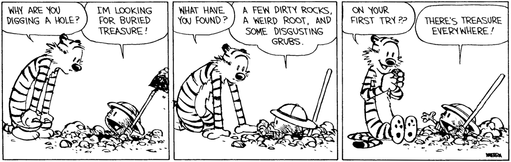

```{r setup, include=FALSE}
knitr::opts_chunk$set(echo = FALSE)
```

Welcome! My name is Katie. I teach statistics and data science classes at Brigham Young University - Idaho. I love math, classic literature, sunshine, food, and any combination thereof. ([math + pizza](https://www.youtube.com/watch?v=gi-TBlh44gY))

The name "Backyard Statistics" is a reference to John Tukey's famous quote:

*The best thing about being a statistician is that you get to play in everyone's backyard.*

Besides the usual interpretation (that statistics can be used in any field of work) I also enjoy the visual it brings to mind: a group of statisticians, dressed in their best explorer outfits, eagerly digging a hole in the backyard to unearth a significant trend or insight. As Calvin says, "There's treasure everywhere!"



This blog acts as a backyard for me to explore in, make mistakes, learn new things, and keep my enthusiasm for playing with statistics.